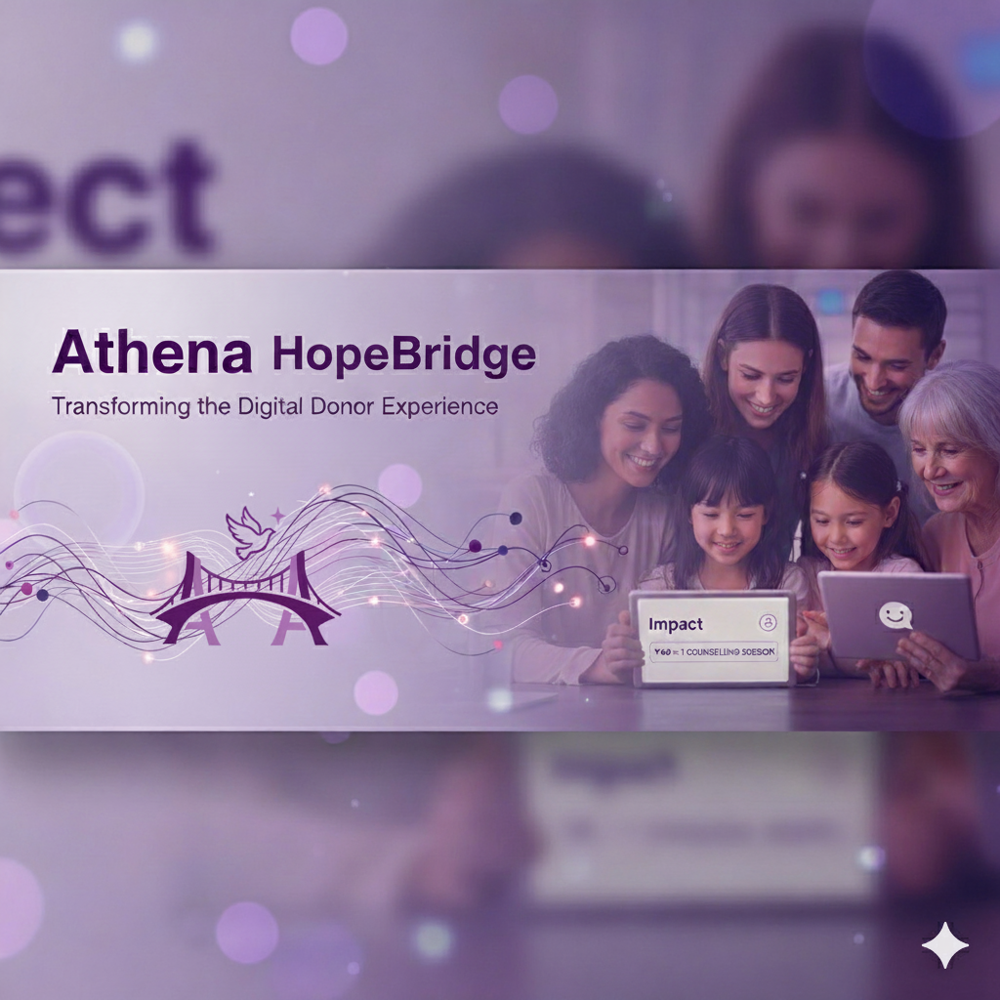

# Athena HopeBridge: Transforming the Digital Donor Experience
### *Morgan Stanley Code To Give 2025 ~ Team Université de Montréal*

<div align="center">



**A multilingual, AI-ready platform reimagining online giving for Shield of Athena.**  
Empathy-first design • Impact transparency • Safe multilingual support • Personalized donor pathways

</div>

---

## 📌 Table of Contents
- [About the Project](#-about-the-project)
- [Team](#-team)
- [Core Features](#-core-features)
- [Architecture](#-architecture)
- [Tech Stack](#-tech-stack)
- [Setup Instructions](#-setup-instructions)
- [Backend API (FastAPI)](#-backend-api-fastapi)
- [AI & RAG Pipeline](#-ai--rag-pipeline)
- [Multilingual Support](#-multilingual-support)
- [Future Work](#-future-work)

---

# 💜 About the Project
**Athena HopeBridge** was built during *Morgan Stanley’s Code To Give 2025 Hackathon* to modernize Shield of Athena’s online donor journey.  
We redesigned the digital experience as an **interactive ecosystem**, not just a donation form.

---

# 👥 Team
| Name | Program | University |
|------|---------|------------|
| **Parsa Makari** | Computer Science | Université de Montréal |
| **Jeff Judicael Pendy** | Computer Science | Université de Montréal |
| **Adam Rahmoune** | Computer Science | Université de Montréal |
| **Seyed Ahmad Farsad** | Computer Science (Grad) | Université de Montréal |
| **Vennila Sooben** | Computer Science (Grad) | Université de Montréal |
| **Yohan Zytoon** | Data Science | Université de Montréal |
| **Ashod Nakashian** | Mentor | Morgan Stanley |
| **Kossi Efu** | Mentor | Morgan Stanley |


---

# ✨ Core Features

## 1. Multilingual Impact-Focused Homepage
- Real-time stats  
- Trauma-aware UI  
- High-contrast accessible design  
- 10 supported languages  
- Impact Pathways for donor clarity  

## 2. Personalized Donor Recommender
- Helps donors find causes aligned with their values  
- Optional personalization via history  

## 3. Athena Guide Chatbot (AI-ready)
- FastAPI-based microservice  
- Multilingual, safe responses  
- Intent detection + embeddings + RAG  
- Crisis-override protection  

## 4. Transparent Donation Flow + Impact Cards
- 3-step donation  
- Visual “Impact Cards”  
- Donor dashboard  

---

# 🧰 Tech Stack

### Frontend
- React
- SCSS theme system
- i18n multilingual system
- Framer Motion animations

### Backend
- Django

### Database
- Relative DB

---

# ⚙ Setup Instructions

## Backend

```
python -m venv .venv
source .venv/bin/activate
pip install -r requirements.txt
uvicorn app.main:app --reload
```

## Frontend

```
npm install
npm run start
```

---

# 🔌 Backend API (FastAPI)

### POST /chat

```
{
  "message": "How can I help?",
  "language": "en",
  "session_id": "123"
}
```

Response:

```
{
  "response": "...",
  "intent": "donation_help",
  "suggestions": ["..."],
  "language": "en"
}
```

---

# 🧠 AI & RAG Pipeline

### Intent Detection (planned)
- Keywords  
- Regex  
- Embeddings  
- ML classifier  

### RAG

### Safety (planned)
- Suicidal/self-harm detection
- Emotional distress routing  

---

# 🌍 Multilingual Support

Currently supports:
- English  
- French  
- Spanish  
- Arabic  
- Mandarin  
- Hindi  
- Portuguese  
- German  
- Dutch  
- Russian  
- Italian  

---

# 🚀 Future Work
- LLM integration  
- Recurring donations  
- Donor milestones  
- Automated receipts  
- Predictive suggestions  
- Volunteer matching  

---

# 🎥 Demo Video
`[https://youtube.com/https://youtu.be/uNwDOkJASlc](https://youtu.be/uNwDOkJASlc)`

---

# 📁 Repo Structure

```
CodeToGive_2025/
  frontend/
  app/
  backend/
  assets/
    logo.png
    poster.png
    screenshots/
```

---

# 💜 Acknowledgements
Thanks to **Morgan Stanley**, **Shield of Athena**, and mentors for guiding this project.
